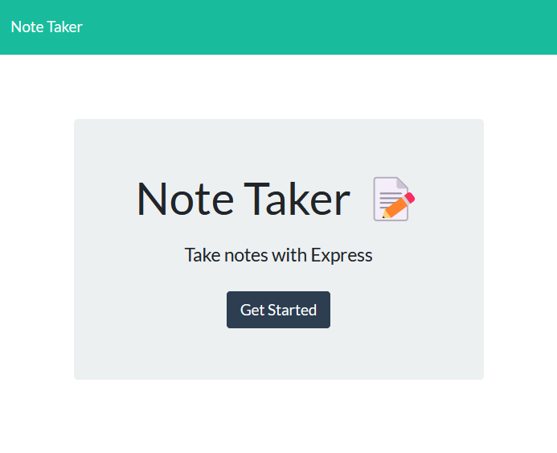

# Note Taker

[](https://opensource.org/licenses/MIT)

## Description

This Note Taker application can be used to write and save notes. This application uses an Express.js back end and saves and retrieves note data from a JSON file.

### User Story

```md
AS A small business owner
I WANT to be able to write and save notes
SO THAT I can organize my thoughts and keep track of tasks I need to complete
```

### Acceptance Criteria

```md
GIVEN a note-taking application
WHEN I open the Note Taker
THEN I am presented with a landing page with a link to a notes page
WHEN I click on the link to the notes page
THEN I am presented with a page with existing notes listed in the left-hand column, plus empty fields to enter a new note title and the note’s text in the right-hand column
WHEN I enter a new note title and the note’s text
THEN a Save icon appears in the navigation at the top of the page
WHEN I click on the Save icon
THEN the new note I have entered is saved and appears in the left-hand column with the other existing notes
WHEN I click on an existing note in the list in the left-hand column
THEN that note appears in the right-hand column
WHEN I click on the Write icon in the navigation at the top of the page
THEN I am presented with empty fields to enter a new note title and the note’s text in the right-hand column
```

## Table of Contents

- [Installation](#installation)
- [Usage](#usage)
- [License](#license)
- [Contributing](#contributing)
- [Questions](#questions)

## Installation

After downloading the source code, run the following commands from the home directory.

```bash
npm init -y
npm i
```

## Usage

The application is hosted on heroku at [https://dpk5e7-note-taker.herokuapp.com/](https://dpk5e7-note-taker.herokuapp.com/).

The application will be invoked by using the following command when running it on your local machine:

```bash
node server.js
```

## License

[](https://opensource.org/licenses/MIT)

This application is covered under the [MIT License](https://opensource.org/licenses/MIT).

### Screenshots

UPDATE THIS...............................................




## Contributing

As this project is part of an individual assignment for the University of Denver's Coding Bootcamp, it would be inappropriate for anyone else to contribute to this project.

## Questions

GitHub Link: [https://github.com/dpk5e7](https://github.com/dpk5e7)

Please contact me at Daniel.Kelly@du.edu with any additional questions you may have.
